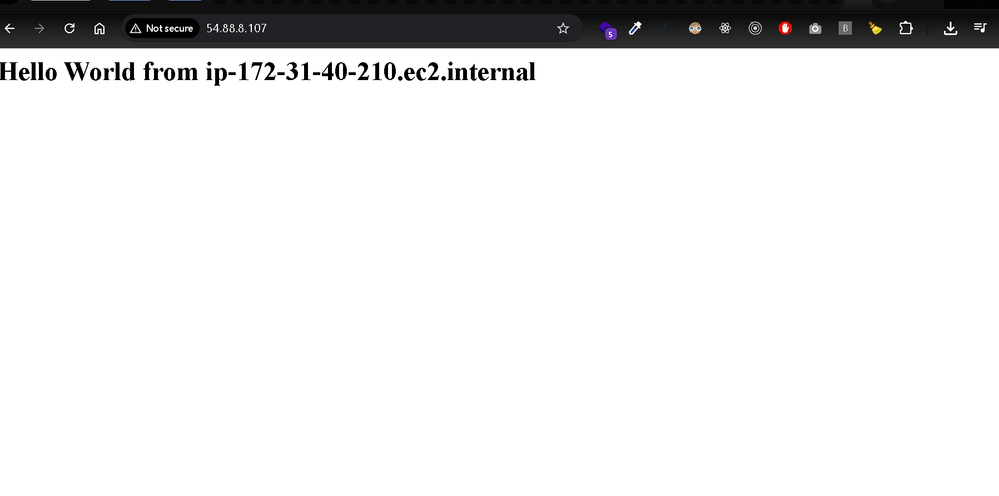

# AWS EC2 Hello World Website 🌍

This project demonstrates launching a simple "Hello World" website on an AWS EC2 instance using **User Data scripts** for automation.

---

## 🚀 What This Project Shows

- Provisioning an **Amazon Linux 2 EC2 instance**
- Using **User Data** to automatically configure the server at launch
- Installing and starting the Apache web server
- Hosting a simple HTML page that displays the server’s hostname

---

## 🛠️ Steps

1. **Launch EC2 Instance**

   - Chose Amazon Linux 2 AMI
   - Selected t3.micro (Free Tier eligible)
   - Configured Security Group → Allowed **HTTP (port 80)** + **SSH (port 22)**

2. **Add User Data Script**

   - In the "Advanced Details" section, pasted this script:
     ```bash
     #!/bin/bash
     yum update -y
     yum install -y httpd
     systemctl start httpd
     systemctl enable httpd
     echo "<h1>Hello World from $(hostname -f)</h1>" > /var/www/html/index.html
     ```

3. **Access the Website**
   - Copy the **Public IPv4 DNS** or **Public IPv4 address** of the instance
   - Open in browser:
     ```
     http://54.88.8.107
     ```

---

## 🌐 Live Demo

👉 [http://54.88.8.107](http://54.88.8.107)

---

## 📸 Screenshots



---

## 💡 Key Takeaways

- Demonstrates **infrastructure automation** using EC2 User Data
- Showcases ability to deploy a working web server in **minutes**
- Foundation for more advanced setups (load balancers, autoscaling groups, etc.)

---
